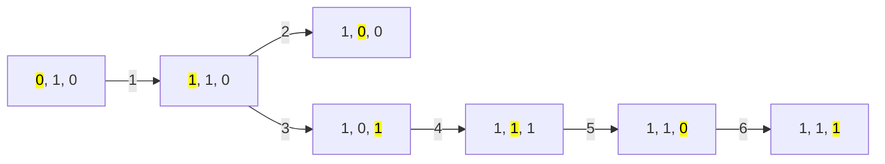
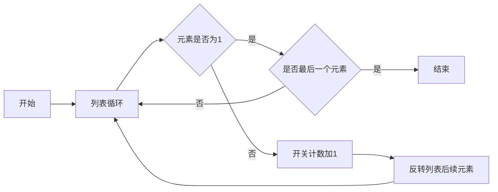
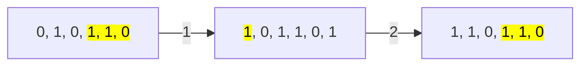
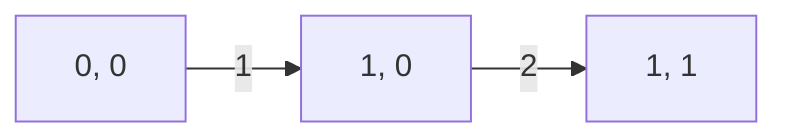
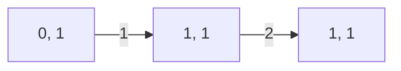
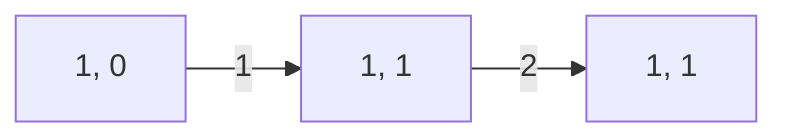
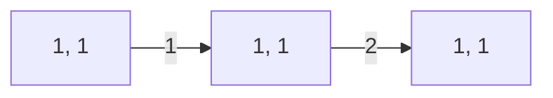

## 问题讨论

给定 `N` 个灯泡，每个灯泡要么是开 (1)，要么是关 (0)。当打开第 `i` 个灯泡时，会导致右侧所有剩余灯泡状态翻转。

目标：找到最小的开关次数，使所有灯泡都变为开状态。

- 约束条件:
  - 1 ≤ N ≤ 1e5
  - A[i] = {0, 1}


## 问题分析

例如：[0, 1, 0]

##  常规算法

常规思路是遍历列表，遇到0时增加开关次数，并翻转后续的所有元素，直到列表完全遍历结束。上图第4步表面上所有灯泡都打开了，但算法流程未结束。如果在每一步都判断是否全部开启，会增加计算复杂度。此算法的时间复杂度为 ：**O(n*(n-1))**



- Python Code

```python 
def normal_cost(bulbs):
  print('origin:', bulbs)
  cost = 0
  for index, bulb in enumerate(bulbs):
    if bulb == 1:
      continue
    else:
      cost += 1
      bulbs[index] = 1
      print('bulbs:', cost, bulbs)
      for i in range(index+1, len(bulbs)):  # 翻转后续元素
        bulbs[i] = int(not bulbs[i])
        cost += 1
        print('\tbulbs:', cost, bulbs)
  return cost

bulbs = [0, 1, 0]
cost = normal_cost(bulbs)
print('cost =', cost)
```
- Result
```bash 
origin: [0, 1, 0]
bulbs: 1 [1, 1, 0]
	bulbs->: 2 [1, 0, 0]
	bulbs->: 3 [1, 0, 1]
bulbs: 4 [1, 1, 1]
	bulbs->: 5 [1, 1, 0]
bulbs: 6 [1, 1, 1]
cost = 6
```

## 贪婪算法
常规算法较为直观，但过程繁琐且时间复杂度高（多次循环翻转元素）。通过贪婪算法，可以将问题分解为更小的子问题，从而提高效率。

以`[0, 1, 0, 1, 1, 0]`为例。



通过两次翻转后，从第三个元素起，列表回到原始状态。因此问题可以被简化为只有两个连续元素的子问题。

两个元素的四种组合 `[0, 0], [0, 1], [1, 0], [1, 1]`
```
[0, 0]
```

```
[0, 1]
```


```
[1, 0]
```


```
[1, 1]
```

在 `[1, 0]` 和 `[1, 1]` 这两种情况中，尽管灯泡的状态已经是打开（1），实际上并不需要进行翻转操作，但为了实现子问题的分解，算法仍然记录了翻转次数。因此，贪婪算法中会存在一些冗余操作。不过，这种设计简化了问题的处理过程，通过略微的冗余换取了整体算法的简洁和效率，这样的权衡是合理的。

Python Code
```python
def greedy_cost(bulbs):
  print('origin:', bulbs)
  cost = 0
  for index, bulb in enumerate(bulbs):
    state = bulb     # state记录当前状态：0或1
    if cost % 2 != 0: state = int(not bulb)   # cost为奇数时，表示需要翻转后续元素，但这里只记录，不翻转，当cost变为偶数时，表示后续元素从奇数状态再次翻转回来，相当于没翻转。
    
    # 如果bulb=1, state=0
    if state == 0:  
      cost += 1   #bulbs[index]==1时，无实际上不用翻转，但需要增加一次cost，目的是为了下一个元素的计算

      if bulbs[index]  == 0:
        bulbs[index] = 1
    print('bulbs:', index, bulbs)
  return cost

bulbs = [0, 1, 0]

cost = greedy_cost(bulbs)
print('cost =', cost)
```

Result
```
origin: [0, 1, 0]
bulbs: 0 [1, 1, 0]
bulbs: 1 [1, 1, 0]
bulbs: 2 [1, 1, 1]
cost = 3
```
相比常规算法，贪婪算法通过减少实际的翻转操作显著降低了复杂度，将问题分解为更易处理的小块，并利用局部最优来实现整体最优解。